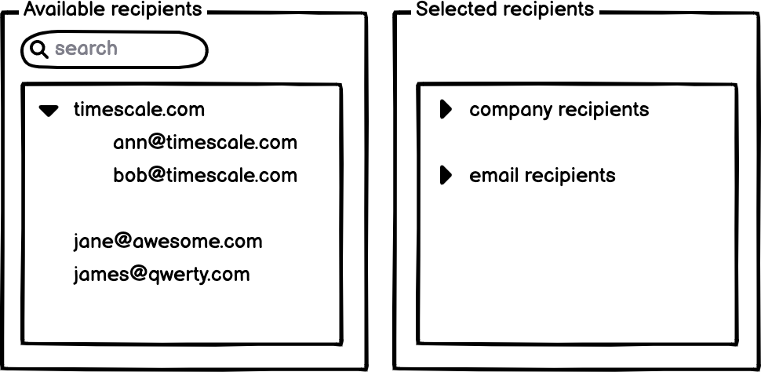

# Timescale Frontend Programming Assignment

Thank you for taking the time to apply for a frontend position at Timescale!
We hope you'll enjoy this small coding assignment that was designed to illustrate your coding skills. It should take around
3 hours to complete at a time of your choosing. If you have any questions, feel free to reach out to us and we'll be happy
to help. Happy hacking!

## Assignment

Implement a React component that allows managing email addresses. The component displays two lists: available recipients and selected recipients.

Use the included `recipientsData.json` file to populate the lists within the component.

### Use cases

As a user, I can
- See the list of all available recipients. A recipient is either an email or a group of emails sharing the same company domain
- Select an individual recipient or a company domain. When a company domain is selected, all emails with the domain are added to the selected recipients' list
- Enter the name of a company into the autocomplete and select a recipient from the available suggestions
- Enter any email in the autocomplete. If the email passes validation it is possible to add it to the list of available recipients
- See the list of the selected recipients that are grouped into company and email recipients. The groups are expandable and show the contained members
- Remove the recipients from the selected list. It is possible to remove an individual email or all emails sharing a domain at once

### The rules

- The component should have a simple and clean design
- You can use a component library of your choice (we use Chakra UI) 
- The component should work in the latest Chrome on Mac OS
- We don't expect a full test coverage, but a couple of unit tests would be nice to have
- Fork the repo to your own account, make it public and send us the repo url when you are completed. We will
  clone and run the site on our local.